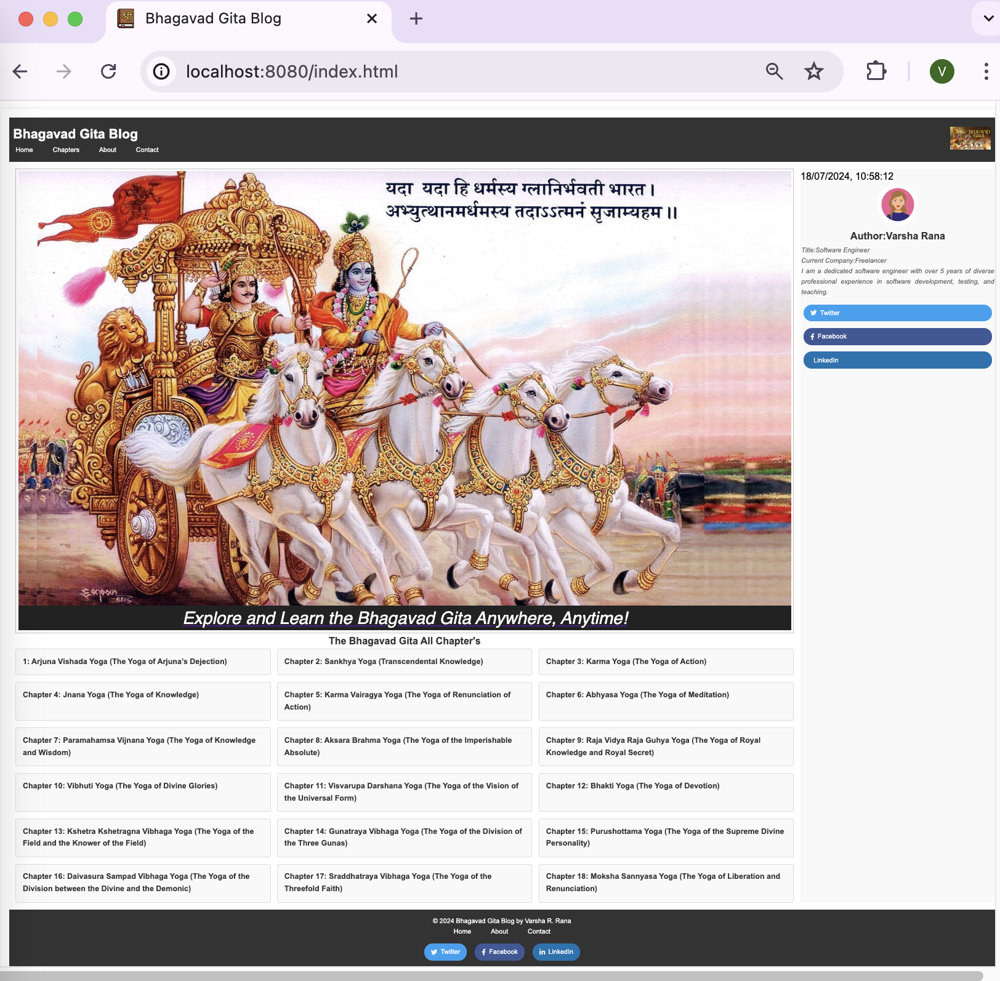

# PersonalBlogProject : Bhagavad Gita Blog

## Overview

The Bhagavad Gita Blog is a web project designed to provide users with easy access to the Bhagavad Gita's teachings. The blog features an intuitive interface where users can explore and learn the Bhagavad Gita chapters anywhere, anytime.

## Features

- **Responsive Design**: The blog is accessible on various devices, ensuring a seamless experience on desktops, tablets, and mobile phones.
- **Interactive Navigation**: The sidebar and chapters list allow for easy navigation through the different chapters of the Bhagavad Gita.
- **Dynamic Content**: Header and footer content are populated dynamically through **API** using JavaScript.

## Screenshot




## Project Structure

The project consists of the following main files and directories:

```
├── index.html
├── assets
│   ├── css
│   │   ├── main.css
│   │   ├── layout.css
│   │   ├── reset.css
│   │   └── typography.css
│   ├── images
│   │   ├── favicon.ico
│   │   ├── logo.jpg
│   │   ├── image.jpg
│   │   ├── image1.jpg
│   │   ├── image2.jpg
│   │   └── IndiaMap.jpg
├── content
│   ├── chapters
│   │   ├── chapter1.html
│   │   ├── chapter2.html
│   │   ├── chapter3.html
│   │   ├── chapter4.html
│   │   ├── chapter5.html
│   │   ├── chapter6.html
│   │   ├── chapter7.html
│   │   ├── chapter8.html
│   │   ├── chapter9.html
│   │   ├── chapter10.html
│   │   ├── chapter11.html
│   │   ├── chapter12.html
│   │   ├── chapter13.html
│   │   ├── chapter14.html
│   │   ├── chapter15.html
│   │   ├── chapter16.html
│   │   ├── chapter17.html
│   │   └── chapter18.html
│   ├── shlokas
│   │   ├── chapter1-shloka.html
│   │   ├── chapter2-shloka.html
│   │   ├── chapter3-shloka.html
│   │   ├── chapter4-shloka.html
│   │   ├── chapter5-shloka.html
│   │   ├── chapter6-shloka.html
│   │   ├── chapter7-shloka.html
│   │   ├── chapter8-shloka.html
│   │   ├── chapter9-shloka.html
│   │   ├── chapter10-shloka.html
│   │   ├── chapter11-shloka.html
│   │   ├── chapter12-shloka.html
│   │   ├── chapter13-shloka.html
│   │   ├── chapter14-shloka.html
│   │   ├── chapter15-shloka.html
│   │   ├── chapter16-shloka.html
│   │   ├── chapter17-shloka.html
│   │   └── chapter18-shloka.html
│   ├── Pages
│   │   ├── about.html
│   │   └── contact.html
├── common
│   ├── header.js
│   ├── header.html
│   ├── footer.html
│   └── footer.js
```

## Getting Started

### Prerequisites

To run this project locally, you need a web browser and a local server setup (optional but recommended).

### Installation

1. **Clone the repository**:
    ```sh
    git clone https://github.com/Vrana710/PersonalBlogProject.git
    ```
2. **Navigate to the project directory**:
    ```sh
    cd PersonalBlogProject
    ```

3. **Open `index.html` in your browser**:
    ```sh
    open index.html
    ```

### Optional: Using a Local Server

For a better development experience, consider using a local server. You can use [Live Server](https://marketplace.visualstudio.com/items?itemName=ritwickdey.LiveServer) if you are using Visual Studio Code, or serve the directory with Python:

```sh
# For Python 3.x
python -m http.server 8000
```
Then open your browser and go to `http://localhost:8000`.

```-zsh
# npx http-server
```
Then open your browser and go to `http://localhost:8080`.

## Technologies Used

- **HTML5**
- **CSS3**
- **JavaScript**
- **Font Awesome** for icons
- **Favicon** for browser tab icon

## License

This project is licensed under the MIT License - see the [LICENSE](LICENSE) file for details.

## Acknowledgments

- The structure and content of the Bhagavad Gita Blog are inspired by the sacred text of the Bhagavad Gita.
- Icons by [Font Awesome](https://fontawesome.com/).

## Contact

For any inquiries, please contact [ranavarsha710@gmail.com](mailto:ranavarsha710@gmail.com).
